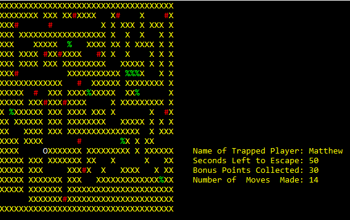
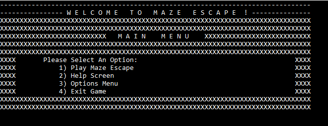

# Maze Game (Written In Assembly)

Written in Assembly, this is a simple maze-traversal game. The player controls movement with the WASD keys, collecting points while trying to find a clear path to the end of the maze. There is also a timer that keeps track of how long completing the maze takes the player.

## Sample Gameplay Screen

## The Main Menu

